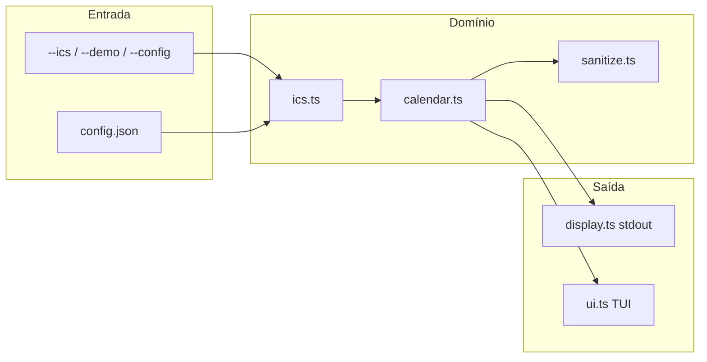

# Design Document

## Overview

CLI Node.js + TypeScript (ESM, Node 20+). Um processo, uma busca, uma renderização.

Não há GOA nem Google Calendar API. `ics` é a única origem de dados reais; `calendar` é o domínio (evento, categoria, dedupe, sanitização). Módulos: `ics`, `calendar`, `display`, `ui`.

```text
CLI (commander)
  → resolve sources (flags | config | demo)
  → ics.fetchSources (HTTP/file, erros redigidos)
  → calendar.dedupe + drop past
  → display.print  |  ui.run
```

## Architecture



## Tech stack

| Peça | Escolha | Por quê |
|------|---------|---------|
| Runtime | Node 20+, ESM | WSL-friendly, fetch nativo |
| CLI | `commander` | flags, conflitos, `--help` |
| ICS | `node-ical` | RRULE / EXDATE / TZ |
| Datas | `Date` local | sem Luxon na v1 |
| TUI | stdin raw + ANSI alternate screen | `more` simples, sem Ratatui |
| Testes | Vitest | ESM + TypeScript |
| Largura | `string-width` | truncar CJK no TUI |

**Fora da v1:** GNOME Online Accounts, OAuth Google Calendar API, escrita de eventos, daemon.

## Components

### `src/cli.ts`

Parse de flags. Resolve Theme (`--theme` > `TCLOCK_WIDGET_THEME` > config > `default`). Junta sources. Chama fetch. Encaminha a stdout ou TUI.

Conflitos: nenhum estilo GOA. `--ics` e `--demo` combinam.

### `src/config.ts`

Lê JSON. Não interpola URLs em mensagens de erro. Path default XDG.

### `src/ics.ts`

Para cada source:

1. Lê bytes (fetch ou `fs`), teto 10 MiB.
2. `node-ical.sync.parseICS`.
3. Expande recorrências com `expandRecurringEvent({ from, to })`.
4. Converte para `CalendarEvent` (account = `ICS #n`).
5. Falha de uma source: `Skipping ICS #n: …` em stderr; se **todas** falharem, exit ≠ 0.

HTTP: `AbortSignal.timeout`, `error.cause` e URLs removidos via `redactSourceError(message, url)`.

### `src/calendar.ts`

Modelo, `category()`, `isPast()`, `durationMinutes()`, `isMultiDay()`, `dedupeEvents()`, `sortEvents()`, `createImportedEvent()`.

Detecta vídeo por host em description/location/url no import ICS.

### `src/sanitize.ts`

Remove sequências de controle do terminal: ESC CSI/OSC, controles, bidi `U+202A–U+202E` / `U+2066–U+2069` / LRM/RLM, whitespace colapsado.

### `src/theme.ts` + `src/display.ts`

Paletas RGB em `src/theme.ts` (`default`, `evangelion`, `nerv`). ANSI `38;2;r;g;b`. `NO_COLOR` só no stdout.

### `src/ui.ts`

Alternate screen `\x1b[?1049h`, raw mode, redraw no resize. Plano `buildBodyPlan` (`same day` → `same week` → `later`). Exportado para testes.

### `src/demo.ts`

Gera eventos locais (standup hoje, dentist amanhã, feriado all-day, OOO) sem rede.

## Error handling

| Caso | Comportamento |
|------|----------------|
| Nenhuma source | stderr help, exit 1 |
| HTTP 4xx/5xx | `ICS #n returned HTTP {status}` |
| Body > 10 MiB | skip source |
| ICS inválido | skip; se zero sucessos, fail |
| TUI sem TTY | `TUI requires a terminal.` |
| URL em Error | `redact` substitui a URL por `ICS #n` |

## Testing strategy

- Unit: sanitize, labels, paletas, dedupe, categorias, parse ICS (string, sem rede), `buildBodyPlan` more.
- CLI parse: `--theme` inválido, múltiplos `--ics`, `--fetch-days` clamp.
- Sem testes de rede real. Fixture em `fixtures/sample.ics` e strings nos testes.

## Requirements traceability

| Requirement | Módulos |
|-------------|---------|
| 1 one-shot | `cli.ts` |
| 2 ICS sources | `ics.ts`, `cli.ts` |
| 3 config | `config.ts` |
| 4 parse window | `ics.ts` |
| 5 dedupe/sanitize/category | `calendar.ts`, `sanitize.ts` |
| 6 stdout | `display.ts` |
| 7 themes | `theme.ts` |
| 8 TUI | `ui.ts` |
| 9 SDD | `.kiro/`, `AGENTS.md` |
| 10 tests | `src/*.test.ts` |
