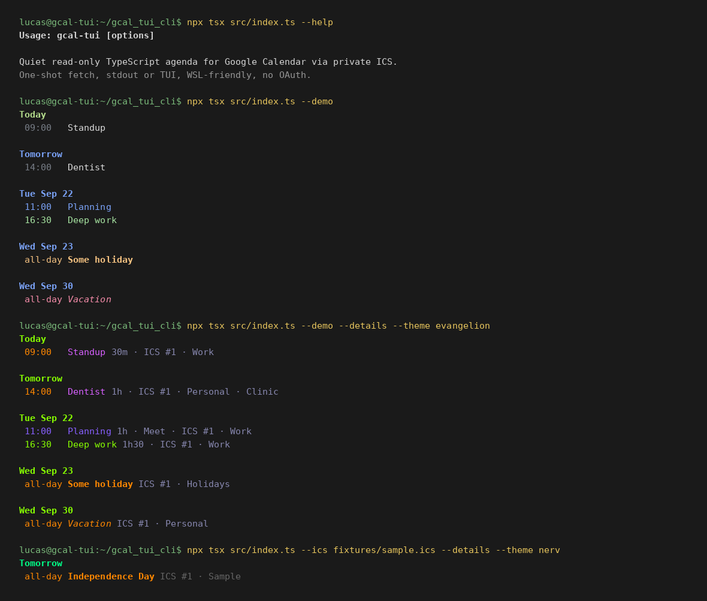

# GCal TUI

> Agenda **somente leitura** no terminal, em **TypeScript**.  
> Google Calendar via **ICS secreto** — sem OAuth, sem GNOME, sem daemon.  
> Busca uma vez, mostra, sai. Spec-Driven (Kiro). Feita para WSL.



| | |
|--|--|
| Stack | TypeScript (Node 20+), CLI `gcal-tui` |
| Fonte | URL iCal secreta, arquivo `.ics`, ou `--demo` |
| Saída | stdout colorido ou TUI (`m` more, `q` quit) |
| Temas | `default`, `evangelion`, `nerv` |
| Fora de escopo | OAuth, GOA, criar/editar eventos, polling |

Este lab é **ICS-first**: no WSL não há GNOME Online Accounts, então a agenda entra pelo endereço secreto em formato iCal.

## SDD (comece por aqui)

Este repo segue [Spec Driven Development no estilo Kiro](https://kiro.dev/docs/specs/): requirements → design → tasks, mais steering e `AGENTS.md`.

| Arquivo | Papel |
|---------|--------|
| [`.kiro/specs/calendar-cli/requirements.md`](.kiro/specs/calendar-cli/requirements.md) | **O quê** (EARS / user stories) |
| [`.kiro/specs/calendar-cli/design.md`](.kiro/specs/calendar-cli/design.md) | **Como** |
| [`.kiro/specs/calendar-cli/tasks.md`](.kiro/specs/calendar-cli/tasks.md) | Tasks rastreáveis |
| [`.kiro/steering/`](.kiro/steering/) | Produto, stack, estrutura, segurança |
| [`AGENTS.md`](AGENTS.md) | Briefing fixo para o agente |
| [`.specify/CONTEXT.md`](.specify/CONTEXT.md) | Snapshot da sessão |
| [`docs/images/cli.png`](docs/images/cli.png) | Print da CLI |
| Este README | Como rodar |

Se código e spec divergirem, a **spec manda**.

## Como rodar

Node 20+.

```bash
git clone git@github.com:silvalnk/gcal-tui-assist-cli.git
cd gcal-tui-assist-cli
npm install
npm test
npx tsx src/index.ts --demo
npx tsx src/index.ts --ics fixtures/sample.ics
npx tsx src/index.ts --ics fixtures/sample.ics --details --theme nerv
npx tsx src/index.ts --tui --demo
```

`--demo` gera compromissos em torno de hoje (Standup, Dentist, feriado, Deep work). Eventos cujo fim já passou somem da lista.

## Google Calendar no WSL

1. No Google Calendar: **Settings → Integrate calendar → Secret address in iCal format**.
2. Guarde a URL num config (não no histórico do shell):

`~/.config/gcal-tui/config.json`

```json
{
  "ics": ["https://calendar.google.com/calendar/ical/SEGREDO/basic.ics"],
  "theme": "default",
  "fetchDays": 60
}
```

3. `npx tsx src/index.ts`

Essa URL é acesso de leitura: se vazar, resete o endereço secreto nas configurações do Google.

`--ics` na linha de comando também funciona, mas pode ir para o histórico do shell. Erros da CLI nunca imprimem a URL — só o rótulo `ICS #n`.

## Flags

| Flag | Descrição |
|------|-----------|
| `--ics <source>` | URL ou arquivo `.ics` (repetível) |
| `--demo` | Agenda de exemplo em torno de hoje |
| `--details` | Duração, Meet, origem, calendário, local |
| `--tui` | Vista interativa (`m` more, `q` quit) |
| `--theme` | `default`, `evangelion`, `nerv` |
| `--no-color` | Sem ANSI no stdout (`NO_COLOR` também) |
| `--fetch-days` | Janela futura (padrão 60) |
| `--config` | Path do JSON |

## TUI

- `q` / Esc: sair
- `m` / Space / Down: more
- `0` / Home: voltar ao topo

## Fora da v1

GNOME Online Accounts, OAuth da Google Calendar API, criar/editar eventos, polling.
